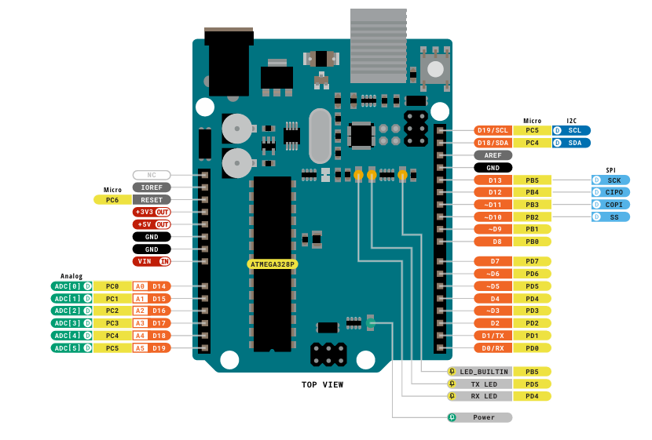
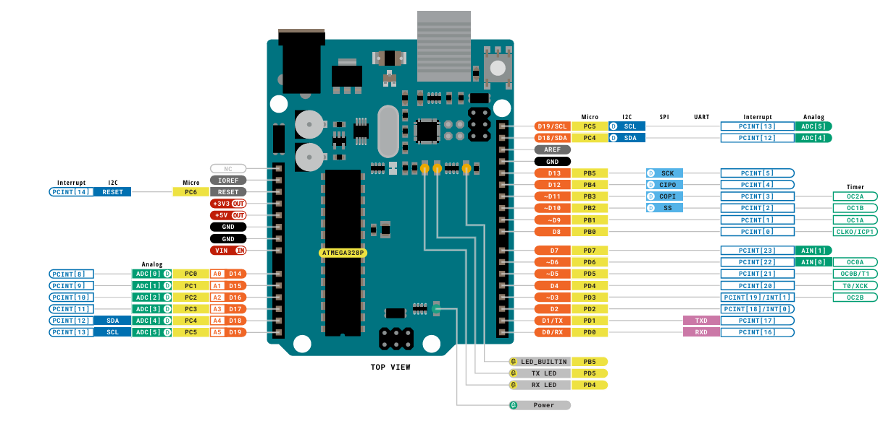
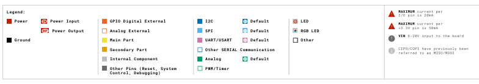

# lab-4-lcd-display

## Laboratorio #4 - Liquid Crystal Display (LCD)

Universidad de Costa Rica - Sistemas Empotrados de Tiempo Real - CI-0155

**Integrantes:** 
- Isabella Rodríguez Sánchez (C26701)
- Esteban Isaac Baires Cerdas (C10844)
- Jorge Ricardo Díaz Sagot (C12565)

**Objetivos del laboratorio:**
1. Uso del módulo LCD1602
2. Conocimiento sobre el protocolo serial I2C
3. Conocimiento sobre los componentes utilizados
4. Diseño e implementación del LCD incluyendo:
  - Texto sencillo
  - Texto scrolling
  - "Animaciones"

---

### OBJ 2: Conocimiento sobre el protocolo serial I2C

#### Inter-integrated circuit (I2C) bus

- El I2C es un protocolo de comunicación local por buses. Este permite comunicación de forma serial bidireccional, half-duplex por medio de dos lineas, SDA(Serial Data) para los datos y SCL(Serial Clock) para el reloj.

- Funciona por medio de una arquitectura maestro-aprendiz donde el microcontrolador en este caso el Arduino Uno R3 es el maestro y el dispositivo LCD es el aprendiz que sigue las ordenes del maestro.

- Tambien se menciona que es un protocolo que puede manejar multiples dispositivos aprediz sin cables extra y prioriza el bajo consumo de energia por encima de la velocidad de transferencia de datos. 

- Una parte importante del funcionamiento del protocolo es que usa un sistema de START/STOP para iniciar y finalizar la comunicación. Se produce un START cuando la linea SDA baja mientras la linea SCL se mantiene alta. Se produce un STOP cuando la linea SDA sube mientras la linea SCL se mantiene alta.

> Todas estas características fueron obtenidas de [5] de las paginas 13 y 175 del libro del curso Embedded Systems Architecture 2nd Edition.

#### Arduino R3
Primero este es el esquema de componentes del Arduino Uno R3:

Obtenido de [4] en su documentación de pinout.

Podemos observar que los conectores de **I2C** se dan por medio de los pines analógicos **A4** y **A5** (**SDA** y **SCL** respectivamente). Y están duplicados de forma digital en los pines **D19** y **D18**.

---

### OBJ 3: Conocimiento sobre los componentes utilizados

TODO @ISA

---

### OBJ 4: Programación del LCD (texto sencillo, scrolling y animaciones)

#### Revisión de las formas de programar el LCD

Para programar y utilizar pantallas LCD (como la LCD1602 o la LCD2004) se utilizan librerías oficiales y las funcionalidades del hardware. En este laboratorio, la exploración sobre las formas de programar el LCD abarca:

- **Configuración y programas básicos:** Involucra la conexión correcta de los pines y el uso de librerías como `LiquidCrystal` para:
  - inicializar el monitor
  - imprimir texto sencillo
  - desplazar texto
  - controlar la luz de fondo (backlight)
  - administrar las coordenadas del cursor
  - caracteres personalizados

Esta información se obtuvo de [1].

- **Animaciones:** Las pantallas LCD permiten crear e insertar gráficos vectoriales a medida mediante la definición de matrices (arreglos de bytes) de 5x8 píxeles. Estos patrones se dibujan visualmente, se convierten a código binario o hexadecimal, y se guardan en la memoria del dispositivo para mostrar formas únicas. La fuente [2] ensena como crear caracteres personalizados para el proposito de funciones LCD mas dinamicas.

#### Texto sencillo

Diseño: [Laboratorio #4 - Liquid Crystal Display (LCD) Hello World](https://www.tinkercad.com/things/cIjcsSK1FTP-laboratorio-4-liquid-crystal-display-lcd-hello-world?sharecode=g8UwlarT3QCvULCgqoQ0eayPNNs1qK-MCkgNnNc4xHk)

Video: [hello_world.mp4](./media/hello_world.mp4)

Codigo: [lcd_display.ino](./code/lcd_display/lcd_display.ino)

#### Texto scrolling

Diseño: [Laboratorio #4 - Liquid Crystal Display (LCD) Autoscroll](https://www.tinkercad.com/things/cih2mpGdvnV-laboratorio-4-liquid-crystal-display-lcd-autoscroll?sharecode=WtUM4_9ktNBCt_ETgbniWzJcT_eFNPF8749XIPibCFY)

Video: [autoscroll.mp4](./media/autoscroll.mp4)

Codigo: [lcd_display_autoscroll.ino](./code/lcd_display_autoscroll/lcd_display_autoscroll.ino)

#### Animaciones

Diseño: [Laboratorio #4 - Liquid Crystal Display (LCD) Casino](https://www.tinkercad.com/things/dqve9ozAi33-laboratorio-4-liquid-crystal-display-lcd-casino?sharecode=3_SfphVUupbPQ_M8Ji9SK-Rcx6fAe9pp9RoYP-7b-BE)

Video: [casino_slots.mp4](./media/casino_slots.mp4)

Codigo: [casino_slots.ino](./code/casino_slots/casino_slots.ino)

---

## Referencias

[1] Arduino Docs. "LCD Displays." Disponible: https://docs.arduino.cc/learn/electronics/lcd-displays/

[2] Naylamp Mechatronics. "Tutorial LCD: conectando tu Arduino a un LCD1602 y LCD2004." Disponible: https://naylampmechatronics.com/blog/34_tutorial-lcd-conectando-tu-arduino-a-un-lcd1602-y-lcd2004.html

[3] Arduino Reference. "randomSeed()." Disponible: https://docs.arduino.cc/language-reference/en/functions/random-numbers/randomSeed/

[4] Arduino Docs. "UNO R3" Disponible: https://docs.arduino.cc/hardware/uno-rev3/#features

[5] D. Lacamera, Embedded Systems Architecture: Design and write software for embedded devices to build safe and connected systems, 2nd ed. Birmingham, UK: Packt Publishing, 2023. ISBN: 978-1-80323-954-5

Citas APA de IA:

- Anthropic. (2024). *Claude* [Modelo de Lenguaje Grande]. <https://claude.ai>
- Microsoft / GitHub. (2024). *GitHub Copilot* [Asistente de código de IA]. <https://github.com/features/copilot>

## Declaración de Uso de Inteligencia Artificial (IA)

Con el fin de cumplir con las normativas de transparencia y ética en el uso de herramientas generativas, a continuación se documenta el uso de IA en este proyecto:

### 1. Herramientas Utilizadas

- **Claude (Anthropic):** Utilizado para la generación de la lógica principal y animaciones del archivo `casino_slots.ino`.
- **GitHub Copilot:** Utilizado para la redacción y estructuración de esta declaración de uso de IA en el archivo `README.md`.

### 2. Propósito y Momento de Uso

La IA de Claude fue utilizada durante la fase de desarrollo para generar el borrador inicial del código del juego de tragamonedas, establecer la lógica de la matriz del LCD y crear la animación de victoria, basándose en la configuración de pines existente. GitHub Copilot fue utilizado al final del proyecto para documentar este proceso.

### 3. Entradas (Prompts) y Contexto Proveído

**Para la generación de `casino_slots.ino` (Claude):**

- **Contexto adjunto:** Se proporcionó el archivo `lcd_display_autoscroll.ino` para dar contexto exacto sobre el cableado y la configuración de los pines del Arduino.
- **Prompt utilizado:**

  > *"Estoy trabajando con un arduino y probando el modulo de display lcd, tengo las conexiones iguales a como están en el archivo adjunto. Ayudame a crear un nuevo sketch con una animación de una máquina de slots de casino, donde se generen los números y si el jugador gana (digamos que 3 simbolos iguales) entonces una animación de ("YOU WIN!!") se reproduce. Introduce una variable que permita hacer que el jugador siempre gane (para pruebas)"*

**Para la redacción de esta documentación (GitHub Copilot):**

- **Prompt utilizado:** Se proporcionó el reglamento de evaluación completo, el contexto sobre cómo se usó Claude previamente, y se solicitó estructurar esta sección del README cumpliendo todos los lineamientos.

### 4. Uso de Resultados, Verificación y Responsabilidad

El código generado por Claude fue integrado en el archivo `casino_slots.ino`. Antes de su implementación final, el código fue analizado, validado lógicamente y probado en el circuito físico para comprobar que la lógica de pines, probabilidades y manejo de memoria del LCD fueran correctos y no presentaran errores. El código sirve como apoyo a la implementación, complementado por revisión y validación propia.
